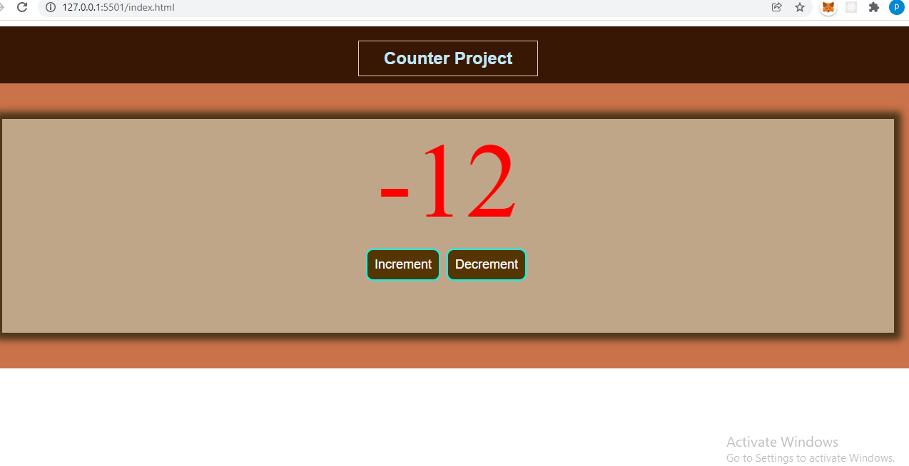

# The Counter Project

## I replicated this project unsupervised to display my understanding of Javascript and how it beautifully makes HTML dynamic with the uncanny help of CSS.

## Tech used for the project:

–[x] JAVASCRIPT ES6–[x] HTML–[x] CSS
